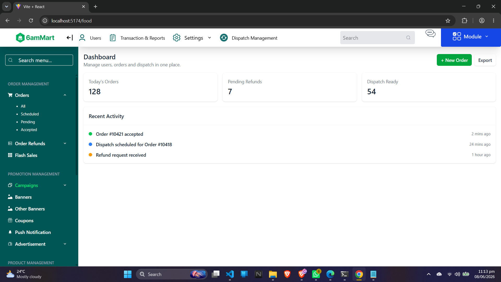
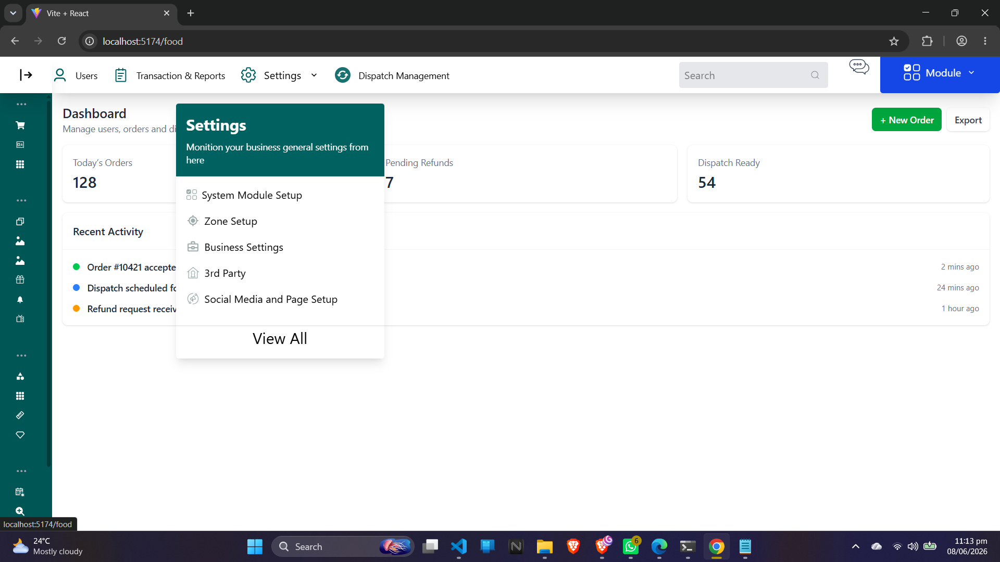

# 🛒 Mart Dashboard Frontend

A modern and responsive mart management dashboard built with **React.js**, **JavaScript**, and **Tailwind CSS**. The application focuses on creating a clean user interface with reusable components and an intuitive user experience.

## 🚀 Features

- 📊 Interactive Dashboard Layout
- 📂 Collapsible Sidebar Navigation
- 🔽 Dynamic Dropdown Menus
- 📱 Fully Responsive Design
- 🎨 Modern UI with Tailwind CSS
- ⚡ Fast Component-Based Architecture
- 🔄 State Management using React Hooks
- 🧩 Reusable Components

## 🛠️ Tech Stack

### Frontend
- React.js
- JavaScript (ES6+)
- Tailwind CSS

### Development Tools
- Vite / Create React App
- Git & GitHub
- VS Code

## 📸 Screenshots

### Overview

### Overview

### Overview

